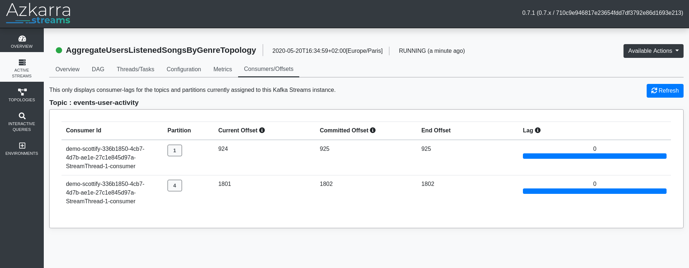
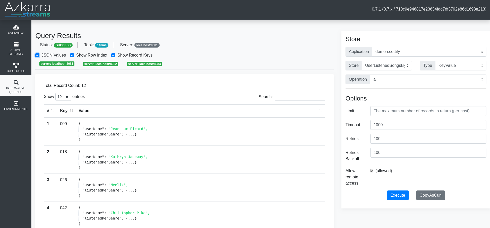

# Demo Azkarra Streams & Kafka Streams - Scottify

***Scottify** is the official media services provider of Starfleet.*

This project contains an example of streams application using Kafka Streams and Azkarra Streams libraries.

This repository is used to make demonstration during Talks (Meetups, Conferences, etc).

 * **Paris Kafka Meetup (2020-02)** : Let's Write A Production-Ready Kafka Streams App Before The End Of This Talk! ([slides](https://speakerdeck.com/fhussonnois/lets-write-a-production-ready-kafka-streams-app-before-the-end-of-this-talk)).

## How to quickly start the demonstration (for scene) ?

```bash
$ ./scottify-demo-start.sh --build true
```

(output)
```
...
🚀 Starting Azkarra application instance : http://localhost:18080/ui

🚀 Starting Azkarra application instance : http://localhost:28080/ui

🚀 Starting Azkarra application instance : http://localhost:38080/ui
```

## How to quickly stop the demonstration (for scene) ?

```bash
$ ./scottify-demo-stop.sh
```

## Build

```bash
$ ./mvnw clean package -DskipTests
$ export PATH=$PATH:`pwd`/scottify-datagen/target/scottify-datagen-1.0-dist/scottify-datagen/bin/
```

## Run local Docker containers

```bash
$ docker-compose up -d
```

## Generate Data

**Generate Music Albums**
```bash
$ scottify-datagen albums --bootstrap-servers localhost:9092 --output-topic db-albums --generate
```

**Generate Scottify Users**
```bash
$ scottify-datagen users --bootstrap-servers localhost:9092 --output-topic db-users --generate
```

**Simulate User Activity**
```bash
$ scottify-datagen events --generate --bootstrap-servers localhost:9092 --output-topic event-user-activity --interval-ms 500
```

## Run Demo

```bash
java -jar scottify-topologies/target/toplistenerpergenre-1.0.jar
```

## Azkarra WebUI


**Topic DAG Vizualization**


**Consumer Group Lag**



**Interactive Queries**




## Licence

Copyright 2021 StreamThoughts.

Licensed to the Apache Software Foundation (ASF) under one or more contributor license agreements. See the NOTICE file distributed with this work for additional information regarding copyright ownership. The ASF licenses this file to you under the Apache License, Version 2.0 (the "License"); you may not use this file except in compliance with the License. You may obtain a copy of the License at

[http://www.apache.org/licenses/LICENSE-2.0](http://www.apache.org/licenses/LICENSE-2.0)

Unless required by applicable law or agreed to in writing, software distributed under the License is distributed on an "AS IS" BASIS, WITHOUT WARRANTIES OR CONDITIONS OF ANY KIND, either express or implied. See the License for the specific language governing permissions and limitations under the License

